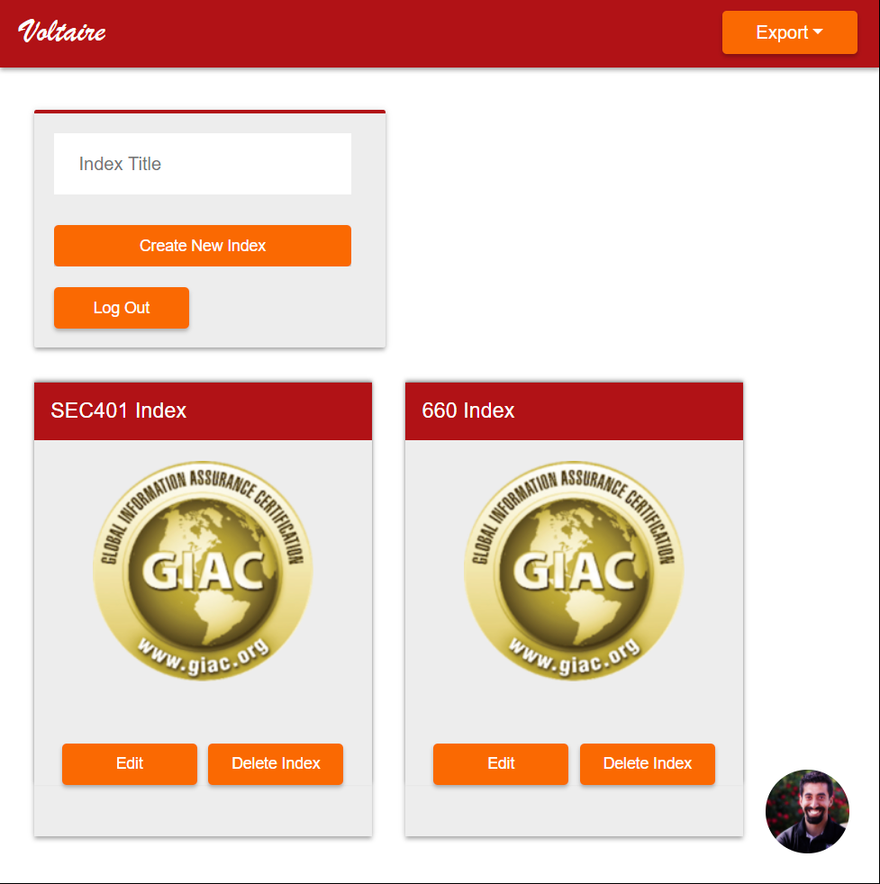
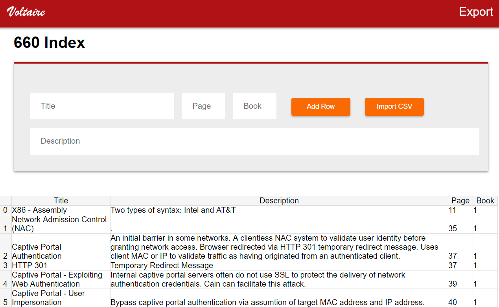
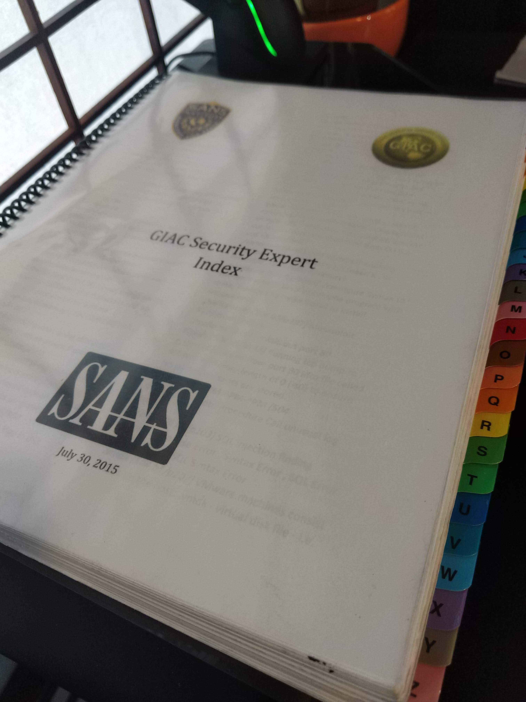

# Voltaire
Voltaire is a web-based indexing tool for GIAC certification examinations. Creating an index with Voltaire is a three phase process involving: documentation/note-taking, sorting & normalization, and word processing. This readme is meant to guide a user through this process. Alternatively, a YouTube walkthrough is avaliable at the link below.

**Application URL:** https://voltaire.publickey.io 

*New Walkthrough Coming Soon* Video: https://youtu.be/bHpkTArlXWc

Provided by @0sm0s1z

## Indexing Methodology

Create a spreadsheet using the online indexing tool or using a document processor that can export to CSV format.

Take notes from the course material. When I feel comfortable with the material I often annotate the location of certain information by filling in a title/page/book and providing a "." under description. This saves me study time while still allowing me to look up specifics related to a topic that I may have missed.

When you click the export button in the upper righthand corner, Voltaire creates an HTML file with the formated content of your index. Press CTRL + A to select all content. Copy and paste the information into a word processor.

Format the document according to your preferences, here are some of mine:

- I set the document to use two columns
- I double-sided print and therefore must have an even number of pages for each letter group in order to bind the index properly
- I adjust formating of the letter headers to fit my preferences ie (Aa, Bb, Cc) -> I typically use the Microsoft Word preformated "Title" option.
- I like to create a coversheet with the date, and course information

Print the document and take it to OfficeMax/Depot for binding.

I typically use a clear front and black backing; however, having a clear cover on each side can be handy if you bind a quick reference to the back of the index ie SANS packet header cheatsheet (what I used on my GSE index)
???

Get Certs

Profit $$$
